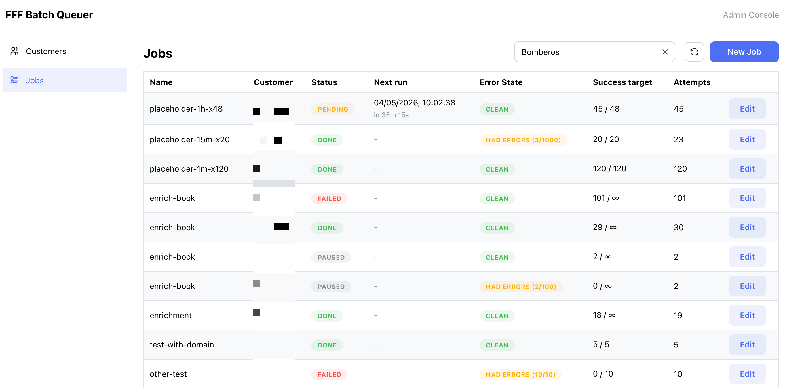

# FFF Batch Queuer

If you need to call an endpoint multiple times, following a given policy, able to automatically stop at some point, this software might be useful for you.

A Cloudflare-based Worker+App that accepts HTTP job definitions, stores them in D1, and
keeps re-calling the target URL with two independent limits:

- an **error attempt limit** (for non-2xx/fetch failures/payloads with `error`),
- a **success iteration limit** (for successful calls),

plus a payload-level override where `{ "stop": true }` immediately marks the
job `done`.



## Architecture

One Worker, two roles:

- **HTTP API (producer)** - `POST /jobs` writes a row to D1 and pushes a
  `{ jobId }` message to the `fff-bq-queue`.
- **Queue consumer** - same Worker. For each message it loads the job, calls
  the target URL, and either marks the job `done` or calls
  `msg.retry({ delaySeconds })` with exponential backoff. The `fff-bq-dlq`
  dead letter queue catches anything that exceeds the platform retry cap and
  flips the job to `failed`.

State lives in D1 across two tables (`customers`, `jobs`). No cron, no Durable
Objects, no Workflows.

## Behaviour summary

| Outcome of the call | What happens |
| --- | --- |
| Body has `{stop:true}` | Job marked `done` immediately, message acked. |
| HTTP 2xx and body without `error` | `success_count` increments. If `successLimit` reached, job is `done`; else retried with fixed `successRetryDelaySeconds`. |
| Non-2xx HTTP response | `error_attempts` increments and job retries with exponential backoff. |
| Network / fetch error | `error_attempts` increments and job retries with exponential backoff. |
| HTTP 2xx with body containing `error` key | `error_attempts` increments and job retries with exponential backoff. |
| Per-job `errorAttemptLimit` reached | Job marked `failed`, message acked. |
| Queues' `max_retries=100` reached | Message routed to `fff-bq-dlq`, consumer marks `failed`. |
| Job already `done`/`failed`/cancelled | Message acked immediately, no fetch. |

Exponential backoff schedule (for errors only, no jitter): `5s, 10s, 20s, 40s,
80s, 160s, 300s, 300s, ...` plus a small random jitter (~0-1s).

## Project layout

```
.
├── db/
│   └── init.sql             # full current schema bootstrap
├── src/
│   ├── api.ts               # Hono routes (POST /jobs, GET /jobs, ...)
│   ├── backoff.ts           # exponential backoff + jitter
│   ├── consumer.ts          # processJobMessage / processDlqMessage
│   ├── db.ts                # D1 helpers
│   ├── index.ts             # entry: fetch + queue handlers
│   └── types.ts             # shared types & constants
├── package.json
├── tsconfig.json
├── wrangler.example.jsonc   # committed template config
└── wrangler.jsonc           # local config (gitignored)
```

## Setup

```bash
npm install
```

Create the Cloudflare resources (one-time per environment):

```bash
# D1 database - copy the printed database_id into wrangler.jsonc
npx wrangler d1 create fff-batch-queuer

# Both queues
npx wrangler queues create fff-bq-queue
npx wrangler queues create fff-bq-dlq
```

Open [`wrangler.jsonc`](wrangler.jsonc) and replace
`REPLACE_WITH_D1_DATABASE_ID` with the id printed above.

Before that, copy the example config:

```bash
cp wrangler.example.jsonc wrangler.jsonc
```

Initialize schema locally and remotely:

```bash
npm run db:init:local
npm run db:init:remote
```

## Run locally

```bash
npm run dev
```

`wrangler dev` provides a local D1 + Queues simulator (Miniflare). The
consumer runs in the same process as the API.

## Customers and tokens

`x-client-token` is the credential. The service hashes it with SHA-256 and
looks up an active row in `customers(token_hash)`.

Use `TOKEN` as `x-client-token` in API calls.

## Deploy

### Backend (Worker)

```bash
cd packages/backend
npm run deploy
```

### Frontend app (Cloudflare Pages)

Build the frontend:

```bash
cd packages/frontend
npm run build
```

Create a Pages project once (pick your own project name):

```bash
npx wrangler pages project create fff-batch-queuer-frontend
```

Deploy the built app:

```bash
npx wrangler pages deploy dist --project-name fff-batch-queuer-frontend
```

Set frontend env vars in Cloudflare Pages (**Settings -> Environment variables**)
before deploying:

- `VITE_API_BASE_URL` (required in production), e.g.
  `https://fff-batch-queuer-backend.<your-subdomain>.workers.dev`
- `VITE_OBSERVABILITY_TOKEN` (optional, only if your backend observability
  endpoints are protected by this header)


Without `VITE_API_BASE_URL`, the frontend falls back to
`http://127.0.0.1:8999` (local dev backend), which will fail in production.

## HTTP API

All API calls require the `x-client-token` header. The raw token is never
stored in jobs; only a SHA-256 hash is matched against `customers.token_hash`.
This acts as:

- **authentication key** (request is rejected if missing), and
- **owner key** (you only see/cancel jobs created with the same token).

### `POST /jobs`

Create a job and immediately enqueue the first attempt.

```bash
curl -X POST https://<your-worker>.workers.dev/jobs \
  -H 'x-client-token: client_abc_123' \
  -H 'content-type: application/json' \
  -d '{
    "name": "ping-internal-api",
    "url": "https://api.example.com/work",
    "method": "POST",
    "headers": { "authorization": "Bearer abc" },
    "payload": { "tenant": 42 },
    "errorAttemptLimit": 1000,
    "successLimit": 1,
    "successRetryDelaySeconds": 30
  }'
```

Response (`201 Created`):

```json
{
  "id": "9c3f...",
  "job": { "id": "9c3f...", "status": "pending", "attempts": 0, ... }
}
```

Field reference for the request body:

| Field | Type | Required | Default | Notes |
| --- | --- | --- | --- | --- |
| `name` | string | yes |  | Human label, indexed for filtering. |
| `url` | string (URL) | yes |  | Target endpoint to call. |
| `method` | `GET`/`POST`/`PUT`/`PATCH`/`DELETE` | no | `POST` | Uppercase only. |
| `payload` | any JSON value | no | none | Sent as JSON body when `method` allows a body. |
| `headers` | `Record<string, string>` | no | none | `content-type: application/json` is auto-added if a JSON body is sent and you didn't override it. |
| `errorAttemptLimit` | integer (>=1, <=100000) | no | `1000` | Error retry cap. Counts non-2xx, fetch failures, and payloads containing `error`. |
| `maxAttempts` | integer (>=1, <=100000) | no | `1000` | Backward-compatible alias for `errorAttemptLimit`. |
| `successLimit` | integer (`-1` or >=1) | no | `1` | Number of successful responses required before marking `done`. `-1` means unlimited success iterations. |
| `successRetryDelaySeconds` | integer (>=1, <=86400) | no | `30` | Fixed delay used between successful iterations when the job is not yet done. |

Token behavior:

- The job is stored with `customer_id` (owner FK), not the raw token.
- The queue message includes `{ jobId, customerId }`.
- Consumer processing and state updates are scoped to that same customer.

### `GET /jobs/:id`

Returns the current state of a job.

### `GET /jobs?status=&name=&limit=&offset=`

Lists jobs, newest first. `limit` defaults to 50 (max 200).

### `POST /jobs/:id/cancel`

Marks a non-terminal job as `failed` with `last_error="cancelled"`. The next
queue delivery for that job will short-circuit and ack.

## How the target URL controls the loop

The Worker fetches your URL with the configured method/headers/payload. The
target should:

- Return JSON body `{"stop": true}` when the work is finally complete. This is
  an override that immediately marks the job `done`.
- Return HTTP 2xx without `error` to count as a successful iteration. The job
  keeps running until it reaches `successLimit` (or forever if `successLimit=-1`),
  with fixed delay `successRetryDelaySeconds` between successful calls.
- Return non-2xx, trigger network/fetch errors, or include `error` in payload
  to count as an error attempt and schedule exponential backoff retries up to
  `errorAttemptLimit`.

Example target handler:

```js
app.post("/work", async (req, res) => {
  const more = await processNextChunk(req.body);
  res.json({ stop: !more });
});
```

## Operational notes

- **Idempotency / duplicate delivery safety:** each attempt is claimed with an
  atomic `pending -> running` transition before fetching, so duplicate Queue
  deliveries for the same job id do not execute concurrently. Terminal
  (`done`/`failed`) jobs are also short-circuited and acked.
- **Customer partitioning:** all read/write/cancel operations are scoped by
  `customer_id` resolved from the token, so one customer token cannot fetch or
  mutate another customer's jobs.
- **Body snapshots:** the last response body is truncated to 4 KB and stored
  on the row for debugging via `GET /jobs/:id`.
- **DLQ as safety net:** Queues will give up after `max_retries=100` (set in
  [`wrangler.jsonc`](wrangler.jsonc)) and route the message to `fff-bq-dlq`.
  The same Worker consumes that queue and flips the job to `failed`. This
  protects against pathological cases where backoff would otherwise grow
  unbounded against the platform's retry budget.
- **Auth:** implemented via `x-client-token` -> SHA-256 lookup in
  `customers.token_hash`; deactivate customers with `is_active = 0`.

## Job failure email alerts (optional)

The queue consumer can send one outbound email when a job becomes `failed`, in
two cases:

1. **Error attempts exhausted** — the job hit `errorAttemptLimit` after repeated
   non-2xx responses, fetch errors, or JSON bodies containing an `error` key.
2. **Dead-letter path** — the main queue exceeded Cloudflare’s retry budget and
   the DLQ consumer marked the job `failed`.

`POST /jobs/:id/cancel` also marks a job `failed`, but **does not** send this
email (only the queue-driven paths above do).

Implementation: [`packages/backend/src/emailAlerts.ts`](packages/backend/src/emailAlerts.ts)
is invoked from [`packages/backend/src/consumer.ts`](packages/backend/src/consumer.ts)
after the job row is updated.

### Prerequisites (Cloudflare)

1. [Email Routing](https://developers.cloudflare.com/email-routing/get-started/)
   enabled on the zone that owns your sender domain.
2. A **`send_email`** binding on the Worker (see
   [`wrangler.example.jsonc`](packages/backend/wrangler.example.jsonc)). Name
   it `SEND_EMAIL` to match the code.
3. Outbound mail follows Cloudflare’s **Send Email** rules: the envelope
   **`from`** must be an address on that zone (for example `alerts@example.com`),
   and **`to`** must be an Email Routing **verified destination address** (the
   mailbox listed under **Email Routing → Destination addresses** after you
   clicked the verification link). A **custom route alias** like
   `hello@yourdomain.com` is not sufficient for `to` — send to the verified
   external inbox (or add that address as a verified destination). See
   [Send emails from Workers](https://developers.cloudflare.com/email-routing/email-workers/send-email-workers/)
   and [Destination addresses](https://developers.cloudflare.com/email-routing/setup/email-routing-addresses/#destination-addresses).

### Worker variables

Set these under `vars` in `wrangler.jsonc` (they deploy with the Worker and appear
in the dashboard), or override locally with `.dev.vars`:

| Variable | Purpose |
| --- | --- |
| `JOB_FAILURE_ALERT_FROM` | Envelope **From** (must be on the zone where Email Routing runs). |
| `JOB_FAILURE_ALERT_TO` | Envelope **To** — use a **verified destination** as above. |

If either variable is missing or empty, no email is sent (the failure path still
completes normally). Logs include a skip line starting with `[email]`.

### Binding restrictions (`destination_address`)

If you set `destination_address` on the `send_email` entry in Wrangler, the
Worker may only send **to** that exact address, so it must match
`JOB_FAILURE_ALERT_TO`. Omit `destination_address` to allow any verified
destination allowed for your account binding.

### Local development

By default, `wrangler dev` **simulates** the Send Email binding: nothing is
delivered to a real inbox; Wrangler logs the message and may write body text to
temp files. See
[Email sending — local development](https://developers.cloudflare.com/email-service/local-development/sending/).
To send real mail while still running the script locally, add **`"remote": true`**
on that `send_email` object in `wrangler.jsonc`.

### Debugging production

Failure alerts run in the **`queue` handler**, not in `fetch`. Use
`cd packages/backend && npm run tail` (or `wrangler tail`) and trigger a failed
job; look for `[email]` lines (`sending`, `send finished`, `failed`, or
`skipped`).

## Useful commands

```bash
npm run typecheck        # tsc --noEmit
npm run dev              # local Worker + D1 + Queues simulator
npm run tail             # stream logs from the deployed Worker
npx wrangler d1 execute fff-batch-queuer --remote --command "SELECT id, name, status, attempts FROM jobs ORDER BY created_at DESC LIMIT 20;"
```
